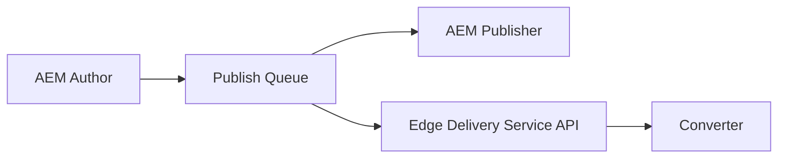

# Your Project's Title...

Your project's description...

## Environments

- Preview: https://main--{repo}--{owner}.hlx.page/
- Live: https://main--{repo}--{owner}.hlx.live/

## Installation

```sh
npm i
```

## Linting

```sh
npm run lint
```
## Setup

### Publishing Pipeline



## Local development

1. Create a new repository based on the `aem-boilerplate` template and add a mountpoint in the `fstab.yaml`
1. Add the [AEM Code Sync GitHub App](https://github.com/apps/aem-code-sync) to the repository
1. Install the [AEM CLI](https://github.com/adobe/helix-cli): `npm install -g @adobe/aem-cli`
1. Start AEM Proxy: `aem up` (opens your browser at `http://localhost:3000`)
1. Open the `{repo}` directory in your favorite IDE and start coding :)

## How to Build/Develop your first Block component

## Pre-requisites

1. Kindly ensure that you have gone through the [set up guides](../../docs/fe_setup_instructions.md).
2. Kindly ensure that you are aware of the [FAQ's](faqs.md) and the [Build](build_and_deploy.md) docs
3. Kindly make sure that the server is up and running!
4. It's also highly recommended to go through the documentation on [aem live](https://www.aem.live/docs/#build)

## Steps to create a new component

### Create a basic component - Definition & its dialog properties


1. In this document we would like to show you how to create a custom block component named text-image.
2. One can use this as an example to create more blocks.
3. Firstly define the block on the Component-definition.json
   
```json
   
   {
          "title": "Text-Image",
          "id": "text-image",
          "plugins": {
            "xwalk": {
              "page": {
                "resourceType": "core/franklin/components/block/v1/block",
                "template": {
                  "name": "text-image",
                  "model": "text-image"
                }
              }
            }
          }
        }
   ```
4. Note that the resource type should be `core/franklin/components/block/v1/block`
5. Next step is to define the component properties in the component-models.json
6. The code to include for image text component is as below
```json
   {
    "id": "text-image",
    "fields": [
      {
        "component": "reference",
        "valueType": "string",
        "name": "image",
        "label": "Image",
        "multi": false
      },
      {
        "component": "text-input",
        "valueType": "string",
        "name": "imageAlt",
        "label": "Alt text",
        "value": ""
      },
      {
        "component": "text-area",
        "name": "text",
        "value": "",
        "label": "Text",
        "valueType": "string"
      },
      {
        "component": "select",
        "name": "imagePosition",
        "filter": "imagePosition",
        "value": "",
        "label": "Image Position",
        "valueType": "string",
        "options": [
          {
            "name": "Left",
            "value": "left"
          },
          {
            "name": "Right",
            "value": "right"
          }
        ]
      }
    ]
   } 
   ```
7. The next step is to add it in a filter (It is a place where we define the group where the component appears)
```json
  {
    "id": "section",
    "components": [
      "text",
      "image",
      "button",
      "title",
      "hero",
      "cards",
      "columns",
      "text-image"
    ]
  }
   ```

### Component styles & scripts
The Component styles & scripts can be defined in the blocks section (within the blocks folder)
eg. a new folder named "text-image" has been created to hold the 2 files 
* [text-image.css](https://github.com/Bounteous-Inc/pricefx-aem/blob/main/blocks/text-image/text-image.css)
* [text-image.js](https://github.com/Bounteous-Inc/pricefx-aem/blob/main/blocks/text-image/text-image.js)

Post making all the changes the outcome can be seen like this, 
Text Image component with left aligned image 


Text Image component with right aligned image


Kindly refer to the following [examples](https://github.com/adobe-experience-league/exlm/tree/56a35accfd904e3636b42262e50f0f508683fd47/blocks) from Adobe that has quite a lot of component examples. 

### Types of components

1. Blocks (Content based components - image, text, buttons etc.)
2. Section (Similar to container)
